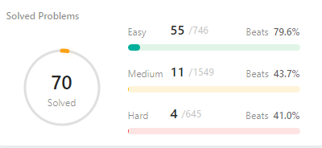

# Summary

This repository serves as a curated platform where I organize a variety of programming challenges and my solutions to them. The problems primarily originate from LeetCode, along with a selection from online sources, textbooks, and coding questions from various company recruitment processes. Not all the problems I have solved are uploaded here, as this space is more of a personal notebook. However, I plan to systematically add more content in my free time and look forward to sharing more with fellow enthusiasts.

My programming expertise includes a strong proficiency in C++, C#, and Python. In addition to these, I also have practical experience with other languages such as C, Java, SQL, Matlab, and R. Below is a chart showing the number of problems I have tackled on LeetCode as of November 10, 2023.
